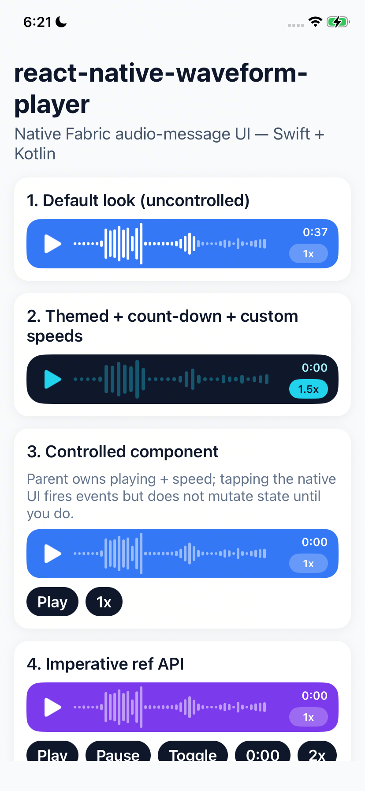
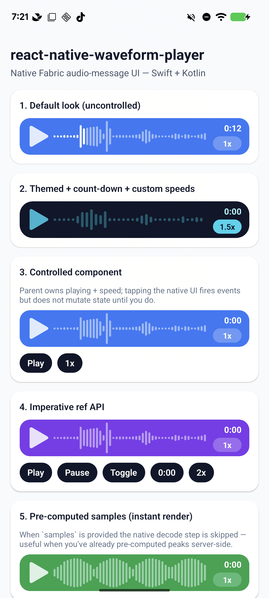

# react-native-waveform-player

Native audio-message UI for React Native — play any local or remote audio file
and render its waveform purely natively. Swift on iOS, Kotlin on Android,
Fabric (new architecture) only.

<p align="center">
  
  
</p>

## Features

- Play / pause / scrub / cycle speed — all rendered in native code, no JS in
  the hot path.
- Custom rounded-bar waveform with a partial-fill playhead (the bar straddling
  the playhead is highlighted up to the exact pixel).
- Press-and-drag scrubbing with zero activation delay.
- Configurable bar size / gap / radius / count, played + unplayed colors.
- Built-in play button, time label (count-up or count-down), and tap-to-cycle
  speed pill — each individually showable / themable.
- Pre-computed `samples` escape hatch when you already have peaks data.
- Controlled (`playing`, `speed`) and uncontrolled modes.
- Imperative `ref.play()` / `pause()` / `toggle()` / `seekTo(ms)` /
  `setSpeed(s)`.
- Opt-in background playback via `playInBackground` (paused on backgrounding
  by default), with `pauseUiUpdatesInBackground` to skip cheap-but-pointless
  UI work while offscreen.
- Events: `onLoad`, `onLoadError`, `onPlayerStateChange`, `onTimeUpdate`,
  `onSeek`, `onEnd`.

## Installation

```sh
npm install react-native-waveform-player
# or
yarn add react-native-waveform-player
```

iOS:

```sh
cd ios && pod install
```

This library is Fabric-only; the host app must have the new architecture
enabled (it's the default in RN 0.85+).

## Usage

```tsx
import { AudioWaveformView } from 'react-native-waveform-player';

export function VoiceNote() {
  return (
    <AudioWaveformView
      source={{
        uri: 'https://example.com/voice-note.m4a',
      }}
      style={{ height: 56 }}
    />
  );
}
```

### Themed + count-down + custom speeds

```tsx
<AudioWaveformView
  source={{ uri: REMOTE_AUDIO }}
  containerBackgroundColor="#0F172A"
  containerBorderRadius={20}
  playedBarColor="#22D3EE"
  unplayedBarColor="rgba(34, 211, 238, 0.35)"
  playButtonColor="#22D3EE"
  timeColor="#A5F3FC"
  timeMode="count-down"
  speedColor="#0F172A"
  speedBackgroundColor="#22D3EE"
  speeds={[1, 1.5, 2]}
  defaultSpeed={1.5}
  barWidth={4}
  barGap={3}
  style={{ height: 56 }}
/>
```

### Controlled component

When `playing` and/or `speed` are supplied, the component is fully controlled
— tapping the play button or speed pill fires `onPlayerStateChange` with the
*requested* new value but does **not** mutate internal state. Update the prop
in your parent state.

```tsx
const [playing, setPlaying] = useState(false);
const [speed, setSpeed] = useState(1);

<AudioWaveformView
  source={{ uri }}
  playing={playing}
  speed={speed}
  onPlayerStateChange={(e) => {
    if (e.isPlaying !== playing) setPlaying(e.isPlaying);
    if (e.speed !== speed) setSpeed(e.speed);
  }}
/>;
```

### Imperative ref API

```tsx
import {
  AudioWaveformView,
  type AudioWaveformViewRef,
} from 'react-native-waveform-player';

const ref = useRef<AudioWaveformViewRef>(null);

ref.current?.play();
ref.current?.pause();
ref.current?.toggle();
ref.current?.seekTo(0);
ref.current?.setSpeed(2);
```

### Pre-computed samples (skip native decode)

```tsx
<AudioWaveformView
  source={{ uri }}
  samples={[0.1, 0.4, 0.85, 0.6, /* ... */]}
/>
```

### Hide every chrome element (visualiser only)

```tsx
<AudioWaveformView
  source={{ uri }}
  showPlayButton={false}
  showTime={false}
  showSpeedControl={false}
  showBackground={false}
/>
```

### Background playback

By default the component pauses playback when the host app is backgrounded
(matches iOS's default behaviour, and we add the same on Android for parity).
Opt in with `playInBackground`:

```tsx
<AudioWaveformView source={{ uri }} playInBackground />
```

When `playInBackground` is `true`:

#### iOS — required

Enable the **Audio** background mode on the host app target. Either:

1. **Xcode** → Project → app target → **Signing & Capabilities** →
   **+ Capability** → **Background Modes** → check
   *Audio, AirPlay, and Picture in Picture*.

   _or_

2. Add to your app's `Info.plist`:

   ```xml
   <key>UIBackgroundModes</key>
   <array>
     <string>audio</string>
   </array>
   ```

The library configures `AVAudioSession` to `.playback` and activates it for
you. Note that this will play through the silent-mode switch and interrupt
other apps' audio (Spotify, etc.) by default. If your app already manages
its own audio session, set the category yourself before mounting the
component and the library won't override it.

#### Android — optional

`MediaPlayer` keeps playing through `Activity.onPause` already, so for
typical voice-message use cases **nothing extra is required**.

If you need playback to survive **device sleep** (screen off + idle, CPU
suspended), add `WAKE_LOCK` to your **app's** `AndroidManifest.xml`:

```xml
<uses-permission android:name="android.permission.WAKE_LOCK" />
```

The library will then automatically call `MediaPlayer.setWakeMode` when
`playInBackground` is `true`. Without the permission `setWakeMode` is
silently skipped (a warning is logged) — playback still works while the
screen is on, it just pauses with the device.

#### Suspending UI work while backgrounded

The 30 Hz progress polling that drives the bars + time label keeps running
even after the OS has stopped compositing the view, so a tiny amount of
CPU is wasted on math + string formatting per tick.

`pauseUiUpdatesInBackground` (default `true`) gates that work:

- `true` — when backgrounded, skip the bars / time-label refreshes. The view
  is offscreen so there's nothing visible to lose. The library snaps the UI
  to the engine's current state on resume.
- `false` — keep refreshing in background (rare; only useful if something
  in your view hierarchy is observing those UI changes from background).

`onTimeUpdate` keeps firing in either case, so Now Playing / Lock Screen /
analytics integrations work the same way.

## Props

| Prop                       | Type                                | Default                   | Description |
| -------------------------- | ----------------------------------- | ------------------------- | ----------- |
| `source` (required)        | `{ uri: string }`                   | —                         | Audio source. Supports `file://`, `https://`, `content://`. |
| `samples`                  | `number[]`                          | `undefined`               | Pre-computed amplitudes in `[0, 1]`. When set, native decode is skipped. |
| `playedBarColor`           | `ColorValue`                        | `#FFFFFF`                 | Color of the highlighted ("played") portion of each bar. |
| `unplayedBarColor`         | `ColorValue`                        | `rgba(255,255,255,0.5)`   | Color of the not-yet-played portion. |
| `barWidth`                 | `number`                            | `3`                       | Bar thickness in dp. |
| `barGap`                   | `number`                            | `2`                       | Gap between bars in dp. |
| `barRadius`                | `number`                            | `barWidth / 2`            | Bar corner radius in dp. |
| `barCount`                 | `number`                            | auto from view width      | Force a specific number of bars. |
| `containerBackgroundColor` | `ColorValue`                        | `#3478F6`                 | Rounded container background. |
| `containerBorderRadius`    | `number`                            | `16`                      | Rounded container corner radius. |
| `showBackground`           | `boolean`                           | `true`                    | Whether to draw the rounded container background. |
| `showPlayButton`           | `boolean`                           | `true`                    | |
| `playButtonColor`          | `ColorValue`                        | `#FFFFFF`                 | Play / pause icon tint (uses SF Symbols on iOS, vector drawables on Android). |
| `showTime`                 | `boolean`                           | `true`                    | |
| `timeColor`                | `ColorValue`                        | `#FFFFFF`                 | |
| `timeMode`                 | `'count-up' \| 'count-down'`        | `'count-up'`              | |
| `showSpeedControl`         | `boolean`                           | `true`                    | |
| `speedColor`               | `ColorValue`                        | `#FFFFFF`                 | Speed pill text color. |
| `speedBackgroundColor`     | `ColorValue`                        | `rgba(255,255,255,0.25)`  | Speed pill background color. |
| `speeds`                   | `number[]`                          | `[0.5, 1, 1.5, 2]`        | Tap-to-cycle speed values. |
| `defaultSpeed`             | `number`                            | `1`                       | Initial speed on mount. |
| `autoPlay`                 | `boolean`                           | `false`                   | Begin playback as soon as the source is ready. |
| `initialPositionMs`        | `number`                            | `0`                       | Seek to this position (ms) on load. |
| `loop`                     | `boolean`                           | `false`                   | Restart from `0` on end-of-track. |
| `playInBackground`         | `boolean`                           | `false`                   | Keep playing when the host app backgrounds. iOS requires the Audio Background Mode; Android optionally honours `WAKE_LOCK`. See [Background playback](#background-playback). |
| `pauseUiUpdatesInBackground` | `boolean`                         | `true`                    | While backgrounded, suspend the bars / time-label refreshes that piggy-back on every progress tick. The OS already skips painting; this saves the cheap math/string work. `onTimeUpdate` is unaffected. |
| `playing`                  | `boolean \| undefined`              | `undefined`               | Controlled playing state. When defined, internal play/pause taps are inert. |
| `speed`                    | `number \| undefined`               | `undefined`               | Controlled speed. When defined, internal speed-pill taps are inert. |

### Events

| Event                  | Payload                                              |
| ---------------------- | ---------------------------------------------------- |
| `onLoad`               | `{ durationMs: number }`                             |
| `onLoadError`          | `{ message: string }`                                |
| `onPlayerStateChange`  | `{ state, isPlaying, speed, error? }` (full snapshot on every transition: load lifecycle, play/pause, speed change) |
| `onTimeUpdate`         | `{ currentTimeMs, durationMs }` (≈30 Hz while playing) |
| `onSeek`               | `{ positionMs }` (end of scrub gesture or `seekTo`)  |
| `onEnd`                | `{}`                                                 |

`state` is one of `'idle' | 'loading' | 'ready' | 'ended' | 'error'`.

### Imperative API

```ts
type AudioWaveformViewRef = {
  play: () => void;
  pause: () => void;
  toggle: () => void;
  seekTo: (positionMs: number) => void;
  setSpeed: (speed: number) => void;
};
```

## Out of scope

- Recording (playback + visualisation only).
- Live / streaming waveforms — we visualise a fixed audio file.
- `react-native-gesture-handler` / Reanimated integration — gestures are
  handled natively for zero JS overhead.

## Contributing

- [Development workflow](CONTRIBUTING.md#development-workflow)
- [Sending a pull request](CONTRIBUTING.md#sending-a-pull-request)
- [Code of conduct](CODE_OF_CONDUCT.md)

## License

MIT

---

Made with [create-react-native-library](https://github.com/callstack/react-native-builder-bob)
