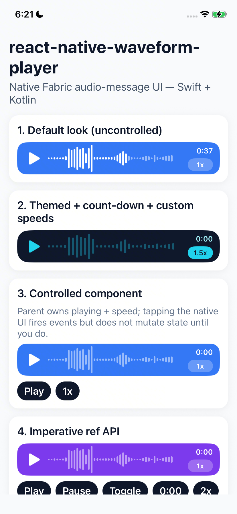
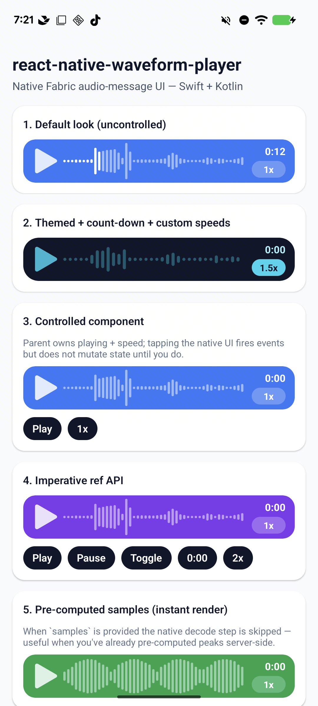

<div class="home-section vp-doc">

## Install

::: code-group

```sh [npm]
npm install react-native-waveform-player
cd ios && pod install
```

```sh [yarn]
yarn add react-native-waveform-player
cd ios && pod install
```

```sh [Expo]
npx expo install react-native-waveform-player
npx expo prebuild
```

:::

See [Installation](/guide/installation) for requirements and Expo details.

## Render a voice note

```tsx
import { AudioWaveformView } from 'react-native-waveform-player';

<AudioWaveformView
  source={{ uri: 'https://example.com/voice-note.m4a' }}
  style={{ height: 56 }}
/>;
```

## Try it in the browser

<WaveformPlayground :controls="false" :events="false" />

Change colors, bar size and more in the [styling playground](/guide/styling#playground).

## See it on a device

<div class="demo-shots">
  <figure>
    
    <figcaption>iOS</figcaption>
  </figure>
  <figure>
    
    <figcaption>Android</figcaption>
  </figure>
</div>

## Need to record too?

This library plays and visualizes audio. To record voice notes with a live waveform, see the sister library [react-native-waveform-recorder](https://maitrungduc1410.github.io/react-native-waveform-recorder/).

</div>
